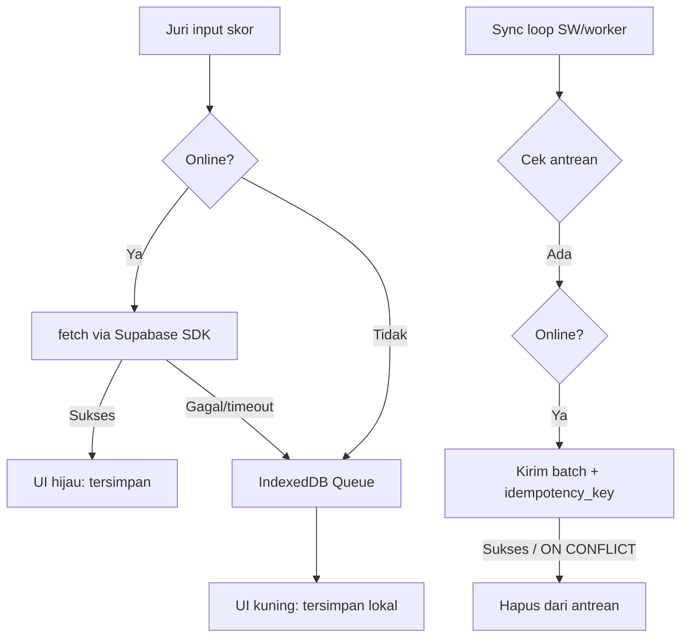

# Arsitektur Sistem: Tool Lomba Agustusan

Dokumen referensi kanonik. Satu-satunya sumber status eksekusi adalah
[`TASKS.md`](./TASKS.md). Pintu masuk backlog: [`START.md`](./START.md).

Dokumen ini **menggantikan** `plan1.md`, `agustusan_app_plan.md`, dan
`agustusan_app_plan_v2.md` (dihapus setelah kontennya terserap). Rekonsiliasi
konflik antar dokumen lama dicatat di bagian [ADR](#adr).

---

## 1. Konfigurasi Lingkungan (Environment Variables)

Tidak ada hardcode alamat, kunci, atau PIN. Aplikasi SPA statis murni
(`adapter-static`), jadi **semua** nilai yang dibutuhkan browser harus berawalan
`PUBLIC_` dan tersedia **saat build** (dibaca lewat `$env/static/public`).
`PUBLIC_` yang kosong saat build = build gagal atau peringatan keras, bukan
silent fallback.

```env
# File: .env.example
# ---------------------------------------------------------
# SISTEM UTAMA
PUBLIC_BASE_URL="http://localhost:5173"   # Dipakai QR e-tiket + wa.me. WAJIB diisi sebelum build rilis.
PUBLIC_APP_NAME="Rawerantas"
PUBLIC_APP_YEAR="2026"
PUBLIC_EVENT_DATE="2026-08-17T07:00:00+07:00"  # ISO-8601. Sumber countdown.

# SUPABASE (Database + Realtime + Storage)
PUBLIC_SUPABASE_URL="https://[YOUR_PROJECT_ID].supabase.co"
PUBLIC_SUPABASE_ANON_KEY="[YOUR_ANON_KEY]"

# KEAMANAN (UX Gate — lihat §6, BUKAN keamanan sungguhan)
PUBLIC_JURI_PIN="170826"
PUBLIC_PANITIA_PIN="260817"
PUBLIC_ADMIN_PIN="194526"

# FEATURE FLAGS
PUBLIC_ENABLE_DEMO_MODE="true"
```

Aturan:

- Variabel non-`PUBLIC_` tidak bisa dibaca di client SPA statis. Tidak ada
  "server-side-only" di arsitektur ini.
- `PUBLIC_*` yang ter-inline di bundle = nilai **build-time**. Mengubah `.env`
  tanpa rebuild tidak berefek pada deploy lama.
- Build-time check: `PUBLIC_BASE_URL` kosong + bukan mode dev → build warning
  (lihat F0-03). QR yang dicetak dengan base-url salah = semua tiket mati.

## 2. Peta Resolusi Domain (Routes)

| Route | Peran | Akses |
|---|---|---|
| `/` | Landing: countdown, daftar lomba, ringkasan skor | Publik |
| `/daftar` | Pendaftaran + pilih metode bayar + upload bukti | Publik |
| `/tiket/[id]` | E-tiket digital (QR, print thermal, WA share) | Publik (via link tiket) |
| `/leaderboard` | Layar penuh Leaderboard live | Publik |
| `/panitia/checkin` | Scanner QR di pintu masuk | PIN Panitia |
| `/juri/mancing` | Input timbangan | PIN Juri |
| `/juri/layangan` | 1-tap mudun/putus | PIN Juri |
| `/juri/layangan-hias` | Skoring 3 kriteria (40/40/20) | PIN Juri |
| `/admin` | Verifikasi bayar, kelola config, round, data lock | PIN Admin |
| `/display` | Big screen (proyektor): leaderboard + pengumuman TTS | PIN Admin (proteksi lemah, kosmetik) |

## 3. Design System & UI/UX Constraint

- **Framework**: Bun + SvelteKit (`adapter-static`, SPA 100%) + Shadcn Svelte
  (Bits UI) + Tailwind CSS.
- **Skema warna** (tokens Tailwind):

| Token | Nilai | Pemakaian |
|---|---|---|
| `background` (hitam dingin) | `#0a0a0a` | base |
| `foreground` (putih cool) | `#f8fafc` | teks utama |
| `primary` (merah midnight) | `#7f1d1d` | aksen berani / danger |
| `secondary` (kuning gold) | `#d97706` | CTA super contrast |
| `success` (hijau zamrud) | `#059669` | status aman/sukses |
| `muted` | `#262626` | border / disabled |

- **Tipografi**: system font stack (San Francisco / Roboto / Segoe UI).
- **Spasi**: kelipatan 4px; padding/margin **maksimal 24px (1.5rem)**. Pengecualian
  hanya ukuran font elemen big-button juri — container tetap ≤24px.
- **Interaksi**: `user-select: none` global; `user-select: text` hanya di
  `input`, `textarea`, `[contenteditable]`.
- **Glassmorphism**: `glass-panel` (bg-white/5, backdrop-blur, border-white/10).
- **Print CSS**: `@media print` ukuran `58mm auto` (dan varian `80mm`), margin 0,
  `.no-print { display:none }`. QR butuh quiet zone → uji fisik printer.

## 4. Skema Database (Drizzle ORM — 9 tabel)

File target: `src/lib/db/schema.ts`.

1. **`competitions`** — jenis lomba. Kolom `scoring_mode` (baru, keputusan):
   `terberat` | `kumulatif` | `jackpot_pita` | `layangan_aduan` | `layangan_hias`.
   Plus `fee`, `min_dp`, `total_quota`, `current_round`, `is_active`.
2. **`payment_configs`** — instruksi bayar: `method` (free-text cocok
   `BCA|DANA|QRIS|CASH`), `account_name`, `account_number`, `qris_image_url`,
   `instructions`, `is_active`.
3. **`participants`** — `ticket_number` unique, `lapak_number`, `status`:
   `registered` | `dp_paid` | `fully_paid` | `checked_in` | `disqualified`.
4. **`participant_payments`** — `amount`, `payment_method`, `proof_image_url`,
   `is_verified`, `verified_by` (hash PIN admin), `created_at`. Log transaksi,
   bukan state.
5. **`scores_mancing`** — `fish_weight_gram`, `fish_type`, `is_jackpot`,
   **`running_total`** (denormalisasi utk mode kumulatif, di-update atomic),
   `recorded_by` (hash PIN), `idempotency_key` unique, `received_at` (server
   receive time — dasar tie-break, bukan `created_at` klien).
6. **`scores_layangan`** — `round`, `status` (`mudun|putus|menang`),
   `recorded_by`, `idempotency_key` unique, `received_at`.
7. **`scores_layangan_hias`** — `aesthetic`, `stability`, `creativity`
   (0–100, check constraint), `total_weighted` (hitung DB:
   `estetika*0.4 + stabil*0.4 + kreativitas*0.2`), `recorded_by`,
   `idempotency_key` unique, `received_at`, `edited_at` (edit window).
8. **`audit_logs`** — append-only: `action`, `entity_type`, `entity_id`,
   `actor_hash`, `payload jsonb`, `created_at`. Wajib untuk mutasi verifikasi,
   perubahan config, data lock. (Mitigasi residual risk §6.)
9. *(opsional, fase 8)* tidak ada. Cukup 8 + audit = 9 total.

Idempotency: setiap tabel skor punya `idempotency_key uuid unique` +
`uniqueIndex`. `ON CONFLICT DO NOTHING` = sukses (retry bukan error).

## 5. Offline Engine & Idempotency (Juri First)

Alur:



Komponen:

- **Service Worker** (`$service-worker` native SvelteKit): cache statis
  versi-tagged, `navigateFallback` ke `index.html` untuk deep-link offline
  (`/tiket/xyz`, `/juri/*`), `skipWaiting`+`clientsClaim`. API/realtime TIDAK
  masuk SW cache (data dinamis).
- **IndexedDB Queue**: `idb`, store `sync_queue` keyed `idempotencyKey`, status
  `pending|syncing|synced`. Order FIFO; op yang gagal tidak memblokir batch
  berikutnya (jendela batas retry).
- **Idempotency**: UUIDv4 per aksi. Server `ON CONFLICT DO NOTHING`. Retry
  karena jaringan yang sudah sukses = dianggap sukses (UI hijau, bukan error).
- **High-water reconcile**: simpan `received_at`/server timestamp tertinggi;
  re-sync hanya delta. Cegah double-entry dari sinkronisasi ulang.
- **Undo-after-sync**: undo 5s berlaku di kedua state. Sudah ter-sync → kirim
  op tombstone (`DELETE`/`REVERT`) + recompute `running_total`. Skor ghost
  dilarang.

> **Amandemen (B4-9/A40/F22/F25):** implementasi saat ini menyederhanakan
> sebagian §5. High-water reconcile, tombstone-with-recompute, draft-restore,
> dan fetch-report (online-recovery) TERSEDIA sebagai utilitas teruji unit
> (`reconcile.ts`, `sync.ts`, `networkStore.ts`) tetapi BELUM terhubung ke
> jalur produksi. Papan baca selalu full-fetch; undo pasca-sync melewati
> tombstone delete (RPC `delete_score`); status online memakai event
> `navigator.onLine`. Ini diterima sebagai deviasi dokumentasi — tidak ada bug
> langsung, dan menghubungkannya penuh (delta re-sync, recompute berbasis
> tombstone) adalah peningkatan berprioritas rendah pasca-acara.

## 6. Model Keamanan (keputusan eksplisit)

**PIN = UX gate, BUKAN keamanan sungguhan.** SPA statis + `adapter-static`
berarti `PUBLIC_JURI_PIN`/`PUBLIC_PANITIA_PIN`/`PUBLIC_ADMIN_PIN` ter-inline di bundle. Siapa pun
dengan devtools bisa baca. Ini diterima sebagai trade-off: event desa, tanpa
musuh canggih, offline-first dijaga penuh.

Mitigasi yang diwajibkan:

1. PIN di-bundle sebagai **SHA-256 hash**, bukan plaintext. Bandingkan
   client-side via `crypto.subtle.digest`.
2. `recorded_by`/`verified_by` = hash PIN, bukan PIN mentah.
3. **`audit_logs` append-only** untuk mutasi sensitif (verifikasi, config,
   data lock).
4. **Data lock toggle** (A7-04): setelah acara, semua tulis diblokir. Anti
   tampering pasca-evaluasi.
5. Residual risk ditulis di README/ARCHITECTURE ini: anon key publik = siapa pun
   bisa tulis tanpa data lock. Jangan dipakai untuk data yang harus
   immutably-trusted tanpa prosedur audit.

RLS (D1-03): `SELECT` publik untuk tabel publik (leaderboard, competitions,
payment_configs, participants). `INSERT` publik utk registrasi + skor (dengan
idempotency). `UPDATE` hanya lewat pola terbatas; verifikasi via audit + hash.
**Tanpa service role key, RLS/konfigurasi storage = tugas manusia** (human queue).

## 7. Aturan Bisnis Lomba

**Mancing:**
- Mode dari `competitions.scoring_mode`.
- Terberat: `MAX(weight)`. Kumulatif: `SUM(weight)` via `running_total`.
- Jackpot pita: flag `is_jackpot`; peserta jackpot menang kategori terpisah,
  tidak ikut urutan biasa.
- Tie-break: **`received_at ASC`** (server receive time). Clock klien tidak
  pernah dipakai untuk urutan.

**Layangan Aduan:**
- Status per-peserta per-round: `mudun|putus|menang`.
- Satu tombol raksasa MUDUN/PUTUS + UndoToast 5 detik.
- State machine: `aktif → mudun|putus` (per round). Round dimajukan admin
  (A7-02) → board reset → status baru.
- Multi-device: last-write-wins per (participant, round). Konflik tidak dicek.

**Layangan Hias:**
- Skor per kriteria 0–100; `total_weighted` dihitung DB:
  `aesthetic*0.4 + stability*0.4 + creativity*0.2`.
- Edit window: 5 menit setelah input (dari `edited_at`), lalu kunci. Rescore
  di luar window = penolakan + entri audit.

**Pembayaran & DP:**
- DP minimum (`min_dp`); DP tidak refundable (warning merah wajib tampil).
- Sisa bayar onsite diizinkan hanya bila `quota - pendaftar > 0` saat tiba.
- **Syarat masuk (keputusan):** minimal `dp_paid` sudah cukup untuk masuk.
  Sisa bayar ditagih panitia di check-in bila kuota masih ada.
- Bukti transfer dikompres ≤200KB (canvas) sebelum upload ke Storage bucket,
  lalu `participant_payments` dibuat.

**Kuota (race condition):** atomik
`UPDATE competitions SET total_quota = total_quota - 1 WHERE id = :id AND total_quota > 0 RETURNING id`.
0 baris = kuota habis → popup, bukan lanjut.

**Registrasi (idempotent):** draft di `localStorage` saat submit timeout; saat
restore, cek dulu `ticket_number exists for phone` sebelum submit ulang —
cegah double-insert (server mungkin sudah commit).

## 8. Deployment

- **Target**: Cloudflare Pages (keputusan). `adapter-static` output ke `build/`.
- **SPA fallback wajib**: `_redirects` di root output
  (`/*  /index.html  200`) supaya `/tiket/xyz`, `/juri/*` deep-link tidak 404.
- Domain + project Pages = human queue.
- `PUBLIC_*` dire-export saat build CF Pages (Build settings → env vars).

## ADR

| # | Konflik | Resolusi |
|---|---|---|
| 1 | `payment_method`: plan1 `bank/cash/qris` vs v2 `cash/transfer` | Free-text cocok `payment_configs.method` + `CASH`. Nilai konsisten antar tabel. |
| 2 | PIN "server-only" (plan1) vs SPA statis | PIN jadi `PUBLIC_*`, hash SHA-256 di bundle, diakui UX gate (§6). |
| 3 | Routes `/daftar` (v2) vs `/display` (plan1) | Keduanya diadopsi + `/juri/layangan-hias` baru. 10 route (§2). |
| 4 | Skoring Hias tanpa tabel | Tabel khusus `scores_layangan_hias` + `total_weighted` DB. |
| 5 | Tie-break `created_at` klien | Ganti `received_at` server. Clock skew HP juri. |
| 6 | Kumulatif via agregasi realtime (tak native) | Denormalisasi `running_total` + update atomic. |
| 7 | Task 25 gabung admin+display (plan1) | Dipecah A7-01..04 + A7-03 display terpisah. |
| 8 | Registrasi rawan double-insert | Idempotency registration + draft-restore-check (§7). |

## Referensi

- [`TASKS.md`](./TASKS.md) — backlog 41 task, satu-satunya sumber status.
- [`START.md`](./START.md) — fase aktif & board tarik.
- [`DEFERRED.md`](./DEFERRED.md) — pool deferral.
- [`JOURNAL.md`](./JOURNAL.md) — log eksekusi.
- [`RUN-REPORT.md`](./RUN-REPORT.md) — laporan run.
